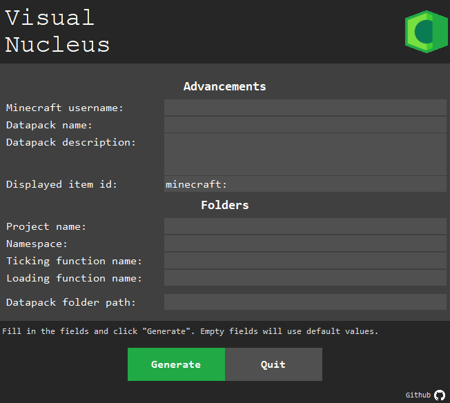

# VisualNucleus
An UI port of [Gnottero's Nucleus](https://github.com/Gnottero/Nucleus) written with Python 3 and Tkinter

>This Python Script require the 'Requests' module to work.
You can install it using the following command:<br>
`pip install requests`



Fill in the fields and click "Generate" to create a template datapack that follows the official conventions.

Datapack templates will be output by default in "VisualNucleus/out"

```
VisualNucleus/out
.
└───Datapack name
    └───data
        ├───global
        │   └───advancements
        ├───minecraft
        │   └───tags
        │       └───functions
        └───namespace
            ├───advancements
            │   └───project_name
            ├───functions
            │   └───project_name
            └───tags
                └───functions
                    └───project_name
```

---
If you want more informations about the conventions, check out:
  
  - The official discord server: https://discord.gg/whFfamE
  - The official conventions website: https://ooboomberoo.github.io/mcdatapacks-wiki/
